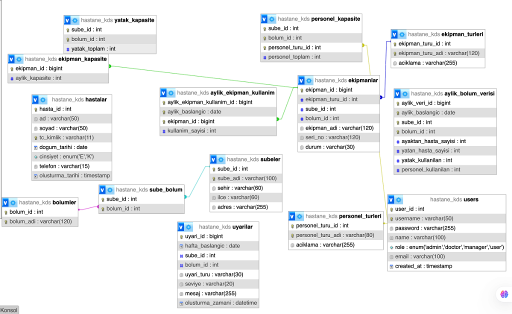

HASTANE KARAR DESTEK SISTEMI (KDS)
Ders: Sunucu Tabanli Programlama
Gelistirici: Merve Solmaz

NOT: Sisteme giris icin kullanici adi: 'admin', sifre: '123' kullanabilirsiniz. (Veritabanina bu kullanıcıyı eklemeyi unutmayin).

PROJE ACIKLAMASI
----------------
Bu proje, hastane yonetim sureclerini kolaylastirmak icin gelistirdigim bir web uygulamasidir. Sunucu tabanli programlama dersi icin Node.js kullanarak yazdim. Projede MVC (Model-View-Controller) yapisina sadik kaldim ve REST standartlarina uygun API adresleri olusturdum.

Sistemin amaci, hastanedeki yatak, personel ve ekipman gibi kaynaklarin durumunu takip etmek ve verimliligi artirmak icin yoneticilere rapor sunmaktir.

SENARYO TANIMI
--------------
Projede uc temel is kurali belirledim:

1. Yatak Doluluk Kontrolu:
Hastanenin yatak dolulugu surekli kontrol edilir. Eger bir bolumde doluluk %90'i gecerse uyari verir. Eger %100 olursa sistem yeni hasta girisine izin vermez.

2. Personel Kadro Analizi:
Doktor ve hemsirelerin uzerindeki is yuku hesaplanir. Ornegin bir doktora 50'den fazla hasta dusuyorsa sistem "Personel Takviyesi Gerekli" der.

3. Atil Kapasite Tespiti:
Son 6 ayin verilerine bakilir. Kullanimi cok dusuk olan (%30 alti) bolumler veya cihazlar tespit edilir raporlanir.

KURULUM ADIMLARI
----------------
Projeyi calistirmak icin asagidakileri yapmaniz yeterli:

1. Dosyalari indirin.
2. Terminali acip "npm install" yazin, gerekli kutuphaneler yuklensin.
3. .env.example dosyasinin adini .env yapip icine veritabani sifrenizi yazin.
4. "npm start" yazarak sunucuyu baslatin.
5. Tarayicidan "localhost:3000" adresine girin.

API ENDPOINT LISTESI
--------------------
Projeyi test ederken kullanabileceginiz adresler:

(Auth)
POST /auth/login - Giris yapma
POST /auth/register - Kayit olma

(Bolum Islemleri)
GET /bolumler - Bolum listesi
PUT /bolumler/:id - Bolum guncelleme
DELETE /bolumler/:id - Bolum silme
GET /bolumler/yogunluk - Doluluk oranlari
POST /bolumler/hasta-kabulu - Hasta giris kontrol

(Personel Islemleri)
GET /personeller - Personel listesi
POST /personeller - Yeni personel ekleme
PUT /personeller/:id - Personel guncelleme
DELETE /personeller - Personel silme
POST /personeller/yuk-analizi - Is yuku analizi
GET /personeller/karneler - Kadro raporu

(Ekipman Islemleri)
GET /ekipmanlar - Ekipman listesi
POST /ekipmanlar - Ekipman ekleme
DELETE /ekipmanlar/:id - Ekipman silme
GET /ekipmanlar/verimlilik - Cihaz verimlilik analizi

(Tahmin)
GET /analiz/tahmin - Gelecek ay hasta tahmini

ER DIYAGRAMI (Veritabani Semasi)
--------------------------------
Asagidaki semada veritabani tablolarimin iliskilerini gorebilirsiniz:

